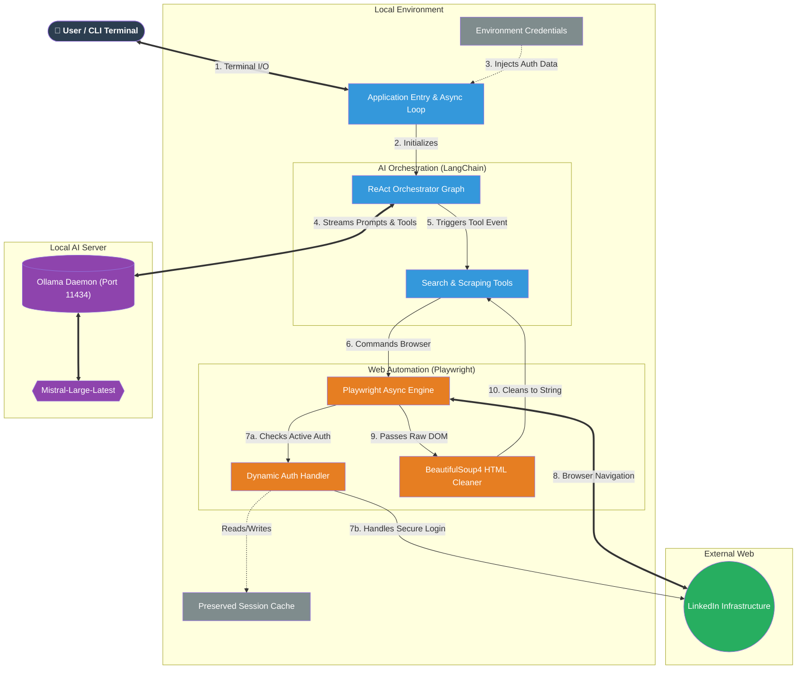

# LinkedIn Scraper Agent: Architecture Overview

This document provides a high-level overview of how the LinkedIn Scraper Agent works, the technologies it uses, and how data flows through the system.

## 🛠 Core Technologies

- **Python (asyncio)**: The foundational language framework. We use `asyncio` to allow the agent to read and write to the web sequentially without freezing.
- **Ollama (Mistral)**: Our local, free-to-use Large Language Model. It acts as the "brain," parsing your human-language requests (e.g., "Find Python developers") and deciding which tools to trigger.
- **LangChain & LangGraph**: The scaffolding that connects the AI "brain" to physical functions (Tools). It loops through a continuous cycle of: *Think -> Act -> Observe -> Answer*.
- **Playwright**: A powerful browser automation library. We use it to physically pop open a Chromium browser, log in, browse URLs, and extract the raw HTML of pages naturally like a human would.
- **BeautifulSoup4**: Parses the nasty, complex raw HTML provided by Playwright and cleans it into small, readable text blocks for the AI to understand.

---

## 🏗 System Architecture Diagram

---

## ⚙️ Step-by-Step Workflow

1. **Initialization ([main.py](file:///Users/apple/Desktop/linkedin-scrapper/main.py) -> [agent.py](file:///Users/apple/Desktop/linkedin-scrapper/agent.py))**
   When you run the script, [agent.py](file:///Users/apple/Desktop/linkedin-scrapper/agent.py) initializes the [BrowserManager](file:///Users/apple/Desktop/linkedin-scrapper/core/browser.py#6-56). It loads your saved session out of `cookies.json`, opens a Chrome window, and verifies you are fully logged into LinkedIn (`https://www.linkedin.com/feed/`).
   *Note: If no cookies are found, it uses the credentials in `.env` to manually login using Playwright!*

2. **User Input**
   The console waits for your request. Once you input something like *"Search for AI engineers"*, it wraps it in a network message and sends it to the **Agent Executor**.

3. **Agent Thought Process (`LangGraph` + `Ollama`)**
   The agent queries your local Ollama server running Mistral. `Mistral` analyzes the prompt and realizes it has a tool available called [search_linkedin](file:///Users/apple/Desktop/linkedin-scrapper/tools/linkedin.py#40-68). It replies, "I should execute [search_linkedin](file:///Users/apple/Desktop/linkedin-scrapper/tools/linkedin.py#40-68) with the query 'AI engineers'".

4. **Tool Execution ([tools/linkedin.py](file:///Users/apple/Desktop/linkedin-scrapper/tools/linkedin.py))**
   The [search_linkedin](file:///Users/apple/Desktop/linkedin-scrapper/tools/linkedin.py#40-68) Python function runs. It tells the [BrowserManager](file:///Users/apple/Desktop/linkedin-scrapper/core/browser.py#6-56) to navigate to the LinkedIn search URL. 
   Playwright scrolls the page and waits a few seconds (mimicking a human to avoid bot bans). It pulls the raw HTML contents of the search results block and sends it back to `BeautifulSoup`, stripping away all the javascript/styling and pulling out pure readable text.

5. **Final Output**
   The text results are sent *back* to the Ollama model. Mistral reads the scraped text, writes up a conversational summary of the search results, and parses it securely back to your terminal window!
